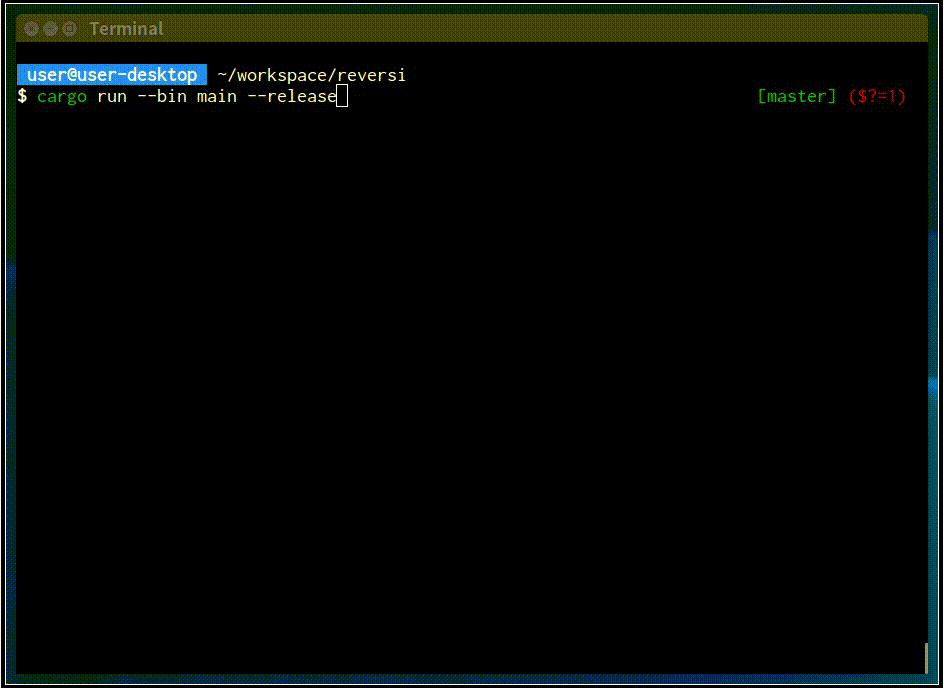

# A simple reversi AI written in Rust

## Features

- Alpha-beta search
- Speed-up by bitboard
- Simple evaluation function
- Wins of random player in almost 100% games
- No cargo package dependency

## How to run (CLI)

```
cargo run --release
```

## Play in the browser (WebAssembly)

The same engine (including the alpha-beta AI and the exact endgame solver) also
runs in the browser via WebAssembly, with no `wasm-bindgen` / `wasm-pack` and no
cargo dependencies. The frontend (React + TypeScript, built with Vite) lives in `web/`.

Prerequisite: the `wasm32-unknown-unknown` target.

```
rustup target add wasm32-unknown-unknown
```

Then, from `web/`:

```
cd web
npm install
npm run dev         # dev server with HMR -> http://localhost:5173
npm run build       # production bundle -> web/dist/
npm run preview     # serve the production build to check it
npm test            # run the Vitest suite
```

`npm run dev` and `npm run build` both first run `npm run wasm`, which builds the
`.wasm` with cargo and copies it into `web/public/`. Vite serves that as
`reversi.wasm`, which the app fetches at runtime (a plain `file://` open will not
work, since the `.wasm` is fetched over HTTP).

To deploy, upload the contents of `web/dist/` to any static host.

## Demo


