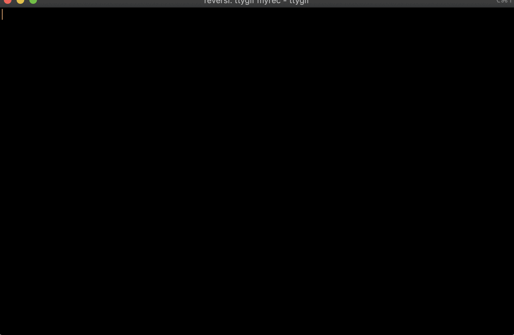

# A simple reversi AI written in Rust

- Alpha-beta search
- Speed-up by bitboards
- Simple evaluation function
- Wins of random player in 100% games

## How to run

```
cargo run --bin main --release
```

## Demo


